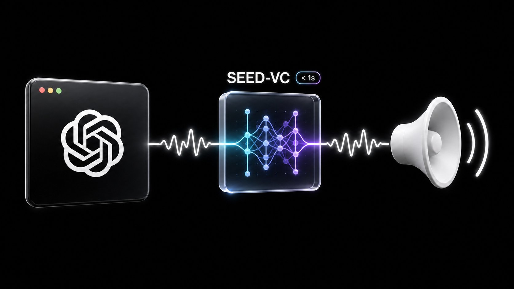

<h1 align="center">ChatGPT Persona Voice</h1>

<p align="center">
  <strong>ChatGPT デスクトップアプリが話している最中に、その声を変える。</strong><br>
  ローカルファーストの Seed-VC による、ほぼリアルタイムの再生。
</p>

<p align="center">
  <a href="README.md">English</a> ·
  <a href="README.zh-CN.md">简体中文</a> ·
  <a href="README.ja.md">日本語</a>
</p>

<p align="center">
  <a href="https://github.com/miuuyy/ChatGPT-Persona-Voice/actions/workflows/ci.yml"></a>
  <a href="LICENSE"></a>
  
  
  
</p>

<p align="center">
  
</p>

Codex Persona Voice は、ChatGPT と Codex の音声モード向けに作られた、独立した
ローカルファーストのデスクトップ音声リレーです。選択したアプリの音声を取得し、
経路全体の準備が確認できたときだけ元の声を抑制します。その後、バージョン固定された
ローカル Seed-VC ワーカーで声を変換し、変換済みストリームをスピーカーへ送ります。

会話と発話そのものは元のアプリが担い、Persona Voice は声質だけをローカルで変換します。
音声変換をクラウド API へ送信する必要はありません。品質とタイミングは、端末、入力音声、
選択した参照音声によって変わります。

> [!IMPORTANT]
> 現在の音声変換は、日本語と中国語の入力音声で最も良い結果が得られます。英語やその他の
> 言語も動作しますが、発音や声質の一貫性には差が出ることがあります。多言語品質、参照音声
> の準備、エンジンプロファイルを改善するコントリビューションを特に歓迎します。

## Persona Voice を使う理由

- **ほぼリアルタイムの変換。** 現在の Seed-VC プロファイルは固定 300 ms ブロックを
  処理し、20 ms の出力フレームをストリーミングします。日付付きの M4 Pro エンジン単体
  スモークでは p95 推論時間 212 ms を計測しましたが、全環境のエンドツーエンド遅延を
  保証する値ではありません。
- **元の声へ重ねず、置き換える。** プロセス単位のネイティブ音声経路は、取得と出力の
  準備が確認できた後にのみ、選択アプリの元音声を抑制します。
- **ローカル推論。** インストール後、固定済みモデルランタイムは選択されたハードウェア上で
  オフライン変換を行います。音声 API キーは不要です。
- **プリセットとローカル参照音声。** クレジット付き VOICEVOX キャラクターと、少数の
  コミュニティ／デモ参照音声を収録しています。Git に追加せず、ローカル manifest から
  非公開の参照音声を追加することもできます。
- **パーソナライゼーション。** 収録済みの声を選ぶほか、権利を持つ非公開の参照音声を追加し、
  変換パイプラインを変えずに各ボイスへ専用キャラクターシーンを組み合わせられます。
- **ローカル履歴を管理可能。** 履歴は既定で無効です。有効にした場合も保存対象は変換済み
  音声だけで、既定では 6 時間後に自動削除され、すぐに全消去できます。

## 仕組み

```text
ChatGPT / Codex アプリ
        │ 選択プロセスの音声
        ▼
ネイティブのプロセス音声経路 ── 元の経路を抑制
        │ 有界 PCM
        ▼
ローカル Seed-VC ワーカー ── 300 ms 入力 / 20 ms 出力フレーム
        │
        ├──────────────▶ スピーカー
        ├──────────────▶ 変換済み音声のみの履歴
        └──────────────▶ 任意の BlackHole 録音バス
```

待機中の Persona Voice は通常のシステム音声に触れません。ネイティブオブザーバーが、
選択した ChatGPT/Codex プロセスで双方向の音声セッションが始まったことを確認した場合
だけリレーが動作します。Electron レンダラーには Node.js アクセスがなく、検証済み IPC、
ライフサイクル、設定、履歴、フェイルクローズ状態遷移は Electron main が所有します。

詳しくは[アーキテクチャ](docs/ARCHITECTURE.md)、[ネイティブプロトコル](docs/NATIVE_PROTOCOL.md)、
[エンジン契約](docs/ENGINE_CONTRACT.md)を参照してください。

## デモ

<p align="center">
  <video src="assets/demo.mp4" controls playsinline width="960" poster="assets/architecture-visual-v2.png"></video>
</p>

<p align="center">
  <a href="assets/demo.mp4"><strong>▶ 1080p デモを見る</strong></a>
</p>

デモでは、クレジット表記された `VOICEVOX:小夜/SAYO` の参照音声を使用しています。
GitHub クライアントでインラインプレーヤーが表示されない場合は、上の動画リンクを
開いてください。

## クイックスタート

### ソースから実行

必要なもの：

- macOS 14.2 以降を搭載した Apple Silicon Mac
- Xcode Command Line Tools
- Git、Bun 1.3.11、Node.js 22.12+、[`uv`](https://docs.astral.sh/uv/)
- 現在のエンジンランタイム用に約 2.5 GiB（依存関係とビルド領域は別途必要）

```bash
git clone --recurse-submodules https://github.com/miuuyy/ChatGPT-Persona-Voice.git
cd ChatGPT-Persona-Voice
bun install --frozen-lockfile
bun run setup:engine
bun run dev
```

初回起動時に **English**、**日本語**、**简体中文** のいずれかを明示的に選びます。
Persona Voice が表示言語を推測することはありません。続くプロジェクト応援ステップは
任意で、エンジンはその場で設定するか、後から設定できます。その後、ChatGPT または
Codex を起動し、Persona Voice で対象を選択して **開始** を押し、音声モードを開始します。
初回のみ macOS が Audio Capture 権限を要求します。モデルとリアルタイム推論経路を
準備するため、エンジンの初回起動は以降より時間がかかります。表示言語は後から
**設定 → アプリケーション** で変更できます。

### パッケージ版 macOS アプリ

モデルランタイムを別配布にすることで、ランチャー本体を小さく保っています。
**設定 → 声 → エンジンをインストール** を開くと、固定済みの非公開ランタイムをアプリ
データへインストールできます。インストーラーは管理対象 Python、パッケージロック、
モデルリビジョン、SHA-256 を検証してから、エンジンをアトミックに公開します。
インストールは中断・再開できます。

アプリ内インストールには、システム Python、Homebrew、ターミナル操作、API キー、
Apple Developer 証明書は不要です。公証は別の配布課題であり、現在の成果物は実験版で、
本番署名とクリーンマシン検証はまだ完了していません。

## プラットフォーム状況

| プラットフォーム | ランチャー | 透過音声リレー | 状況 |
| --- | --- | --- | --- |
| Apple Silicon macOS 14.2+ | 実装済み | 実装済み | 実験的プレビュー |
| Intel macOS | レンダラーはビルド可能 | ブロック | 非対応 |
| Windows | シェル + プロセス検出 | 未実装 | 非対応 |
| Linux | シェル + PipeWire 検出 | 未実装 | 非対応 |

透過リレーが完成していないプラットフォームでは、シェルが理由を明示して停止します。
隠れたパススルーや identity-converter fallback はありません。詳しくは
[プラットフォームマトリクス](docs/PLATFORM_MATRIX.md)を参照してください。

## 参照音声

同梱カタログには現在、四国めたん、ずんだもん、春日部つむぎ、冥鳴ひまり、九州そら、
WhiteCUL、櫻歌ミコ、小夜/SAYO、ナースロボ＿タイプＴ、春歌ナナ、猫使アル、満別花丸、
琴詠ニア、コミュニティ版 JARVIS 参照音声、および非公式の Donald Trump デモ音声が
含まれています。

VOICEVOX サンプルは公式ショーケース音声から作成され、必要なクレジットを保持します。
コミュニティおよび著名人の参照音声にはそれぞれの条件が適用され、実在の発言や公式な
推薦として示してはいけません。使用権限のある声だけを利用してください。詳しくは
[voice manifest](voices/manifest.json) と単一の
[third-party notice inventory](THIRD_PARTY_NOTICES.md)を参照してください。

## 安全性とプライバシー

- 取得した生 PCM は意図的に保存・記録されません。
- 履歴が受け取るのは、出力セッションへ渡された変換済みフレームだけです。
- 待機中は元の経路を変更せず、音声セッション開始の証明後にだけ元音声を抑制します。
- エンジン／出力障害時は、明示的な Stop が経路復元を証明するまで抑制を維持します。
- 設定、ログ、モデル、参照音声、任意の履歴は、使用中ローカルのワークスペースまたは
  アプリデータ内に留まります。
- BlackHole と OBS は別の信頼境界です。変換済み音声のみの録音バスを使う場合、OBS の
  macOS Screen Capture 音声をミュートしてください。そうしないと元のシステム音声も
  同時に録音されます。

機密性の高い音声で試す前に、[プライバシー](docs/PRIVACY.md)、[セキュリティ](SECURITY.md)、
[トラブルシューティング](docs/TROUBLESHOOTING.md)を確認してください。

## 開発

```bash
bun run test
bun run typecheck
bun run build:renderer
bun run check
bun run smoke:engine
```

- [開発ガイド](docs/DEVELOPMENT.md)
- [アーキテクチャ](docs/ARCHITECTURE.md)
- [プラットフォームマトリクス](docs/PLATFORM_MATRIX.md)
- [ネイティブプロトコル](docs/NATIVE_PROTOCOL.md)
- [エンジン契約](docs/ENGINE_CONTRACT.md)
- [モデルアダプター](docs/MODEL_ADAPTERS.md)
- [リリースエンジニアリング](docs/RELEASE.md)

## コントリビューションとライセンス

現在の実験的スコープに沿ったコントリビューションを歓迎します。
[CONTRIBUTING.md](CONTRIBUTING.md) と [行動規範](CODE_OF_CONDUCT.md)をお読みください。

ランチャーのオリジナルコードは [MIT License](LICENSE) で提供されます。Seed-VC は
GPL-3.0 のままであり、モデル、参照音声、依存関係には各自のライセンスと条件が適用
されます。[Third-party notices](THIRD_PARTY_NOTICES.md)も参照してください。

## 免責事項

Codex Persona Voice は独立したソフトウェアであり、OpenAI との提携や承認関係は
ありません。ChatGPT、Codex、OpenAI の商標は OpenAI に帰属します。本プロジェクトは、
認証、サブスクリプション、権限、アクセス制御を回避するものではありません。
